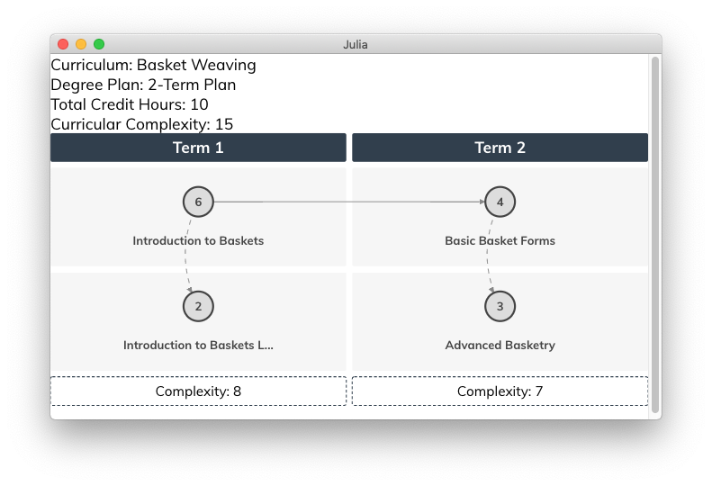

# Curricular Analytics Toolbox

[CurricularAnalytics.jl](https://github.com/heileman/CurricularAnalytics.jl) is a toolbox for studying, analyzing and comparing academic program curricula and their associated degree plans. The toolbox was built using the [Julia programming language](http://julialang.org). For assistance in installing the toolbox, see the [Installation](@ref) section. We welcome contributions and usage examples. If you would like to contribute to the toolbox, please see the [Contributor Guide](@ref). To cite this toolbox, please see [How to Cite CurricularAnalytics.jl](@ref).

## Terminology

A basic understanding of the terminology associated with curricula and degree programs will greatly facilitate the use of this toolbox.

A *curriculum* for an academic program consists of the set of courses that a student must complete in order to earn the degree associated with that program. By successfully completing a course, a student should attain the learning outcomes associated with the course, while also earning the number of credit hours associated with the course. For instance, most associate degree programs require a student to earn a minimum of 60 credit hours, and most bachelor's degree programs require a student to earn a minimum of 120 credit hours.

In order to attain the learning outcomes associated with course ``B``, a student may first need to attain some of the learning outcomes associated with some other course, say ``A``. In order to capture this requirement, course ``A`` is listed as a *prerequisite* for course ``B``. That is, students may not enroll in course ``B`` unless they have successfully completed course ``A``.  More generally, we refer to these types of requirements as *requisites*, and we differentiate between three types:

- Prerequisite : course ``A`` must be completed prior to attempting course ``B``.
- Co-requisite : course ``A`` may be taken prior to or at the same time as attempting course ``B``.
- Strict co-requisite : course ``A`` must be taken at the same time as course ``B``.

A *degree plan* is a term-by-term arrangement for taking all of the courses in a curriculum, layed out so as to satisfy all requisite relationships. A *term* is typically offered either in the semester (two terms/academic year) or quarter (three terms/academic year) format. It is common for schools to offer two-year degree plans for associates degrees and four-year degree plans for bachelors degrees.

There is a one-to-many relationship a curriculum and the degree plans that satisfy the curriculum. I.e., many different degree plans can be constructed to satisfy a single curriculum. Furthermore, it is likely that some of these degree plans are better suited to the needs of particular students. In addition, it is important to note that a degree plan may contain more courses than are stipulated in a curriculum. For instance, a student may not have the background necessary to take the first math course in a curriculum, necessitating the addition of a prerequisite math class as a part of the degree plan.

### -- Example --

Consider the Basket Weaving curriculum, consisting of the following four courses:

- BW 101 : Introduction to Baskets, 3 credits
- BW 101L : Introduction to Baskets Lab, 1 credit; strict co-requisite: BW 101
- BW 111 : Basic Basket Forms, 3 credits; prerequisite: BW 101
- BW 201 : Advanced Basketry, 3 credits; co-requisite: BW 111

The following degree plan completes this curriculum in two terms while satisfying all of the requisite relationships:

- Term 1: BW 101, BW 101L
- Term 2: BW 111, BW 201

A visual representation of this degree plan is as follows:

The solid arrow in this figure represents a prerequisite relationship, while the dashed arrows represent co-requisite relationships.

## Toolbox Overview

The toolbox represents curricula as graphs, allowing various graph-theoretic measures to be applied in order to quantify the complexity of curricula. In addition to analyzing curricular complexity, the toolbox supports the ability to visualize curricula and degree plans, to compare and contrast curricula, to create optimal degree plans for completing curricula that satisfy particular constraints, and to simulate the impact of various events on student progression through a curriculum.

The basic data types used in the CurricularAnalytics.jl libraries are described in [CurricularAnalytics.jl Data Types](@ref). This section also describes a number of convenient functions that can be used to create curricula and degree plans. Functions that can be used to read and write curricula and degree plans to/from permanent storage are described in [Persisting Curricula & Degree Plans](@ref).

Metrics that have been developed to quantify the complexity of curricula and degree plans are described in [Metrics](@ref). Functions that can be used to study degree plans, and to create degree plans according to various optimization criteria are described in [Optimizing Degree Plans](@ref).

Visualization-related functions are described in [Visualizing Curricula and Degree Plans](@ref).

Detailed examples and tutorials can be found in the [Curricular Analytics Notebooks](https://github.com/heileman/CA-Notebooks) repository.
