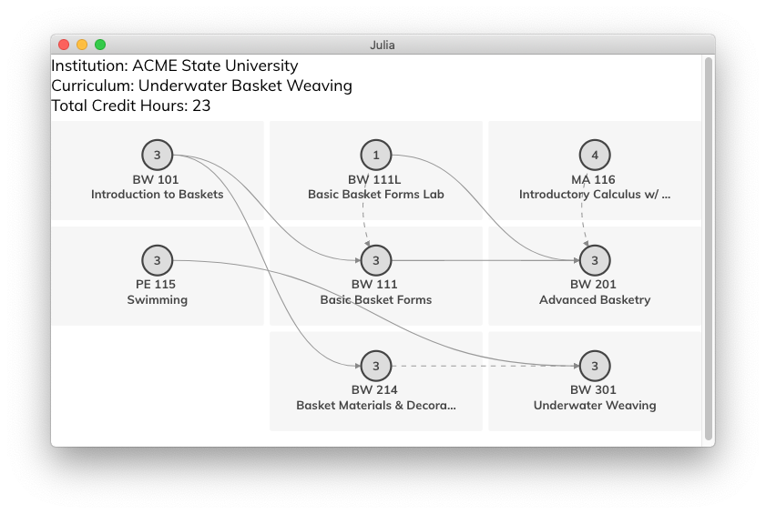
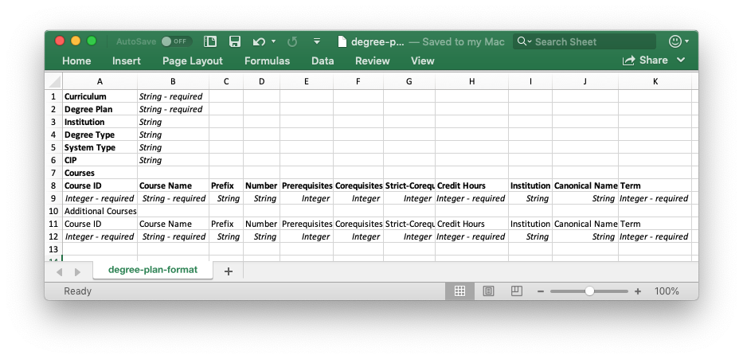
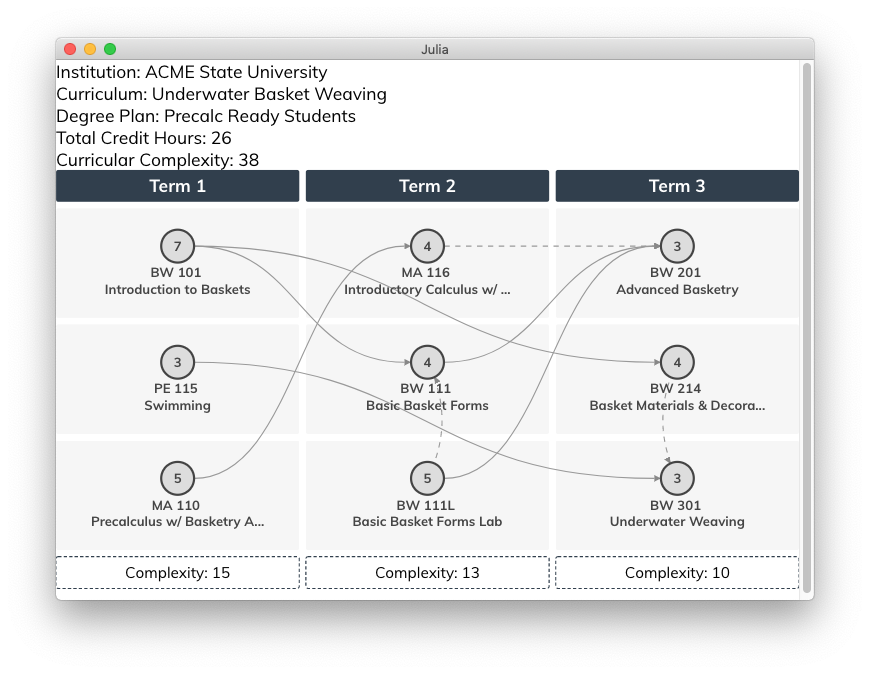

# Reading/Writing Curricula & Degree Plans

The ability to read/write curricula and degree plans to disk is greatly facilitated by using the functions described here.

## File Format

The *CSV file format* stores data as comma-separated values in a text file, allowing data to be presented in tabular form. You can open CSV files with either a text editor or by using your favorite spreadsheet program. The sections below describe the CSV file formats used for curricula and degree plans, as well as functions that can be used to read/write these CSV files.

### Curricula

The CSV file format used to store curricula is shown below:

The elements shown in boldface are required keywords that must appear in the curriculum CSV file, while the italicized elements are user supplied arguments.  Notice that the italicized elements stipulate the input type, and whether or not the argument is required.

More specifically, the data that is expected to follow each keyword provided in the curriculum CSV file is described next:

* Curriculum : the name of the curriculum/degree program (required).
* Institution : the name of the institution offering the curriculum/degree program.
* Degree Type : the type of degree that will be earned by completing the curriculum.
  Allowable values are: AA, AS, AAS, BA, BS.
* System Type : the type of system the institution's operations on.
  Allowable values are: semester quarter
* CIP : the Classification of Instructional Programs (CIP) code for the curriculum. See: `https://nces.ed.gov/ipeds/cipcode`
* Courses : a keyword that appears on a line by itself (i.e., with no following data). A single header row should appear below this keyword, followed by the row-by-row list of courses associated with the curriculum. The required keywords in the header row, and the data that should appear below each header are as follows:
  * Course ID : the unique integer ID of the course (required).
  * Course Name : the name of the course (required).
  * Prefix : the prefix associated with the course.
  * Number : the number associated with the course.
  * Prerequisites : a list of all required prerequisite, by Course ID.
  * Corequisites : a list of all required corequisite, by Course ID.
  * Strict-Corequisites : a list of all required strict-corequisite, by Course ID.
  * Credit Hours : the number of credit hours associated with the course (required).
  * Institution : the institution offering the course (may be different from the institution offering the curriculum).
  * Canonical Name : the canonical (i.e., common) name used for the course.

Below is an example curriculum file that uses the aforedescribed format:

A link to this CSV file can be found [here](./curriculum-ex.csv), and a visualization of this curriculum, created using the function described in [Visualization Functions](@ref), is as follows:


### Degree Plans

The CSV file format used to store degree plans is shown below:

The elements shown in boldface are required keywords that must appear in the degree plan CSV file, while the italicized elements are user supplied arguments.  Notice that the italicized elements stipulate the input type, and whether or not the argument is required.

The data that is expected to follow each keyword provided in the degree plan CSV file is the same as those for curriculum CSV files above, with two additions:

* Degree Plan : the name of the degree plan (required).
* Term : this keyword appears at the end of the header row associated with courses (required).  The term that a course should appear in as a part of a degree plan should be listed under this keyword.

Below is an example degree plan file that uses the aforedescribed format. This degree plan satisfies the curriculum shown in the previous section, and it includes one additional prerequisite course. Notice that term information is also provided with each course.

A link to this CSV file can be found [here](./degree-plan-ex.csv), and a visualization of this degree plan, created using the function described in [Visualization Functions](@ref), is as follows:


## Writing Curricula and Degree Plans

```@docs
write_csv
```

## Reading Curricula and Degree Plans

```@docs
read_csv
```
