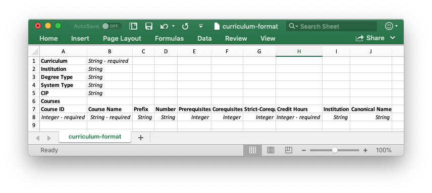

# Persisting Curricula & Degree Plans

The ability to read/write curricula and degree plans to disk is greately facilitated by using the functions described here.

## File Format

The *CSV file format* stores data as comma-separated values in a text file, allowing data to be presisted in tabular form. You can open CSV files with either a text editor or by using your favorate spreadsheet program.  

### Curricula

The CSV file format used to store curricula is shown below:

The elements shown in boldface are required keywords that must appear in the curriculum CSV file, while the italicized elements are user supplied arguments.  Notice that the italicized elements stipulate the input type, and whether or not the argument is required.

More specifically, the data that is exepected to follow each keyword provided in the curriculum CSV file is described next:

* Curriculum : the name of the curriculum/degree program (required).
* Institution : the name of the institution offering the curriculum/degree program.
* Degree Type : the type of degree that will be earned by completing the curriculum.
  Allowable values are: AA, AS, AAS, BA, BS.
* System Type : the type of system the insitutions operations on.
  Allowable values are: semester quarter
* CIP : the Classification of Instructional Programs (CIP) code for the curriculum. See: `https://nces.ed.gov/ipeds/cipcode`
* Courses : a keyword that appears on a line by iteslf (i.e., with no following data). A single header row should appear below this keyword, followed by the the row-by-row list of courses associated with the curriculum. The required keywords in the header row, and the data that should appear below each header are as follows:
  * Course ID : the unique integer ID of the course (required).
  * Course Name : the name of the course (requierd).
  * Prefix : the prefix associated with the course.
  * Number : the number associatedw with the course.
  * Prerequisites : a list of all required prerequisite, by Course ID.
  * Corequisites : a list of all required corequisite, by Course ID.
  * Strict-Corequisites : a list of all required strict-corequisite, by Course ID.
  * Credit Hours : the number of credit hours associated with the course (requried).
  * Institution : the institution offering the course (my be different from the institution offering the curriculum).
  * Canonical Name : the canonical (i.e., common) name used for the course.

An example curriculum file using the aforedescribed format is as follows:

A link to this CSV file can be found [here](./curriculum-ex.csv).

### Degree Plans

The CSV file format used to store degree plans is shown below:


An example curriculum stored using the aforedescribed format is as follows:


A link to this CSV file can be found [here](./degree-plan-ex.csv)

## Writing Curricula and Degree Plans

```@docs
write_csv
```

## Reading Curricula and Degree Plans

```@docs
read_csv
```
