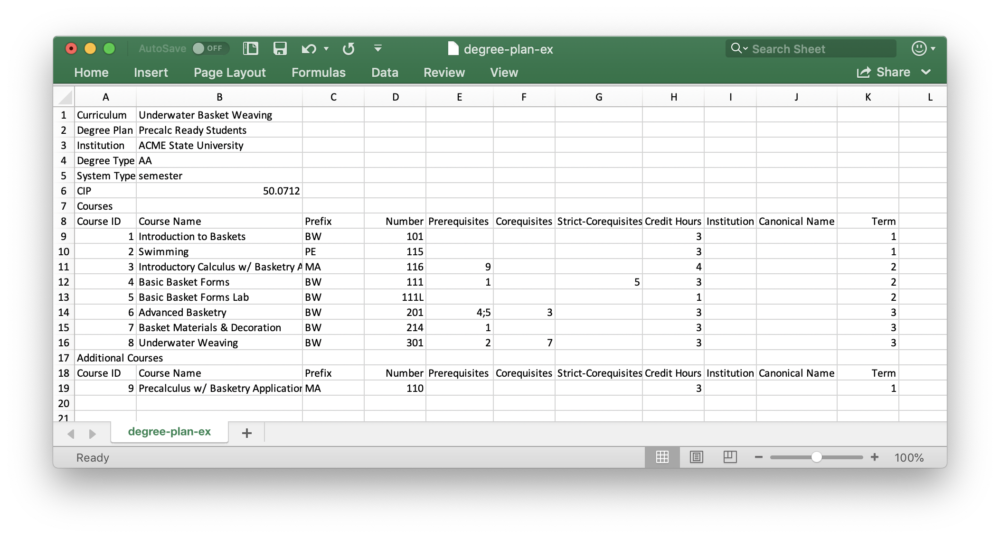

# Persisting Curricula & Degree Plans

The ability to read/write curricula and degree plans to permanent storage is greately facilitated by using the functions described here.

## File Format

The *CSV file format* stores data as comma-separated values in a text file, allowing data to be presisted in tabular form. You can open CSV files with either a text editor or by using your favorate spreadsheet program.  There 


### Curricula

The CSV file format used to store curricula is shown below:

The elements shown in boldface are required keywords that must appear in the curriculum CSV file, while the italicized elements are user supplied arguments.  Notice that the italicized elements stipulate the input type, and whether or not the argument is required.

More specifically, the data that is exepected to follow each keyword provided in the curriculum CSV file is described next:
* Curriculum - 
* Institution -
* Degree Type - 
Note that these keywords and their associated ar

An example curriculum file using the aforedescribed format is as follows:

A link to this CSV file can be found [here](./curriculum-ex.csv)

### Degree Plans

The CSV file format used to store degree plans is shown below:


An example curriculum stored using the aforedescribed format is as follows:



A link to this CSV file can be found [here](./degree-plan-ex.csv)

## Reading Curricula and Degree Plans

```@docs
read_csv
```

## Writing 

```@docs
write_csv
```